# SELENE

SELENE tracks spacecraft in the space between Earth and the Moon. It spots engine burns nobody announced, works out where a spacecraft could go next, and tells you which telescope should look at it. This repository is a working demo: the physics and planetary data are real (NASA JPL), while the spacecraft that maneuver and every telescope observation are simulated.

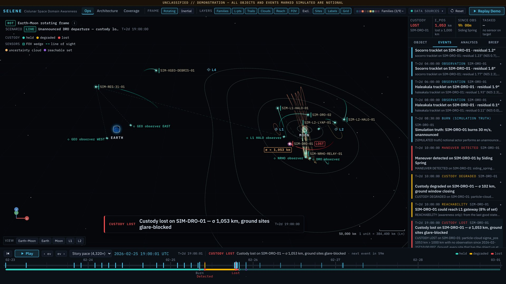
*Ten and a half hours after an unannounced burn, moonlight has blinded the ground telescopes and SELENE reports that it has lost track of the spacecraft.*

## What it does

The region between geostationary orbit (GEO, about 36,000 km up) and the Moon (about 384,000 km away) is called cislunar space, or xGEO. SELENE keeps custody of the objects out there. Custody means knowing where an object is well enough to find it again.

It does four things:

- flags maneuvers (engine burns that change an orbit) that nobody announced
- shows where a maneuvering object could get to
- decides which sensor should look at which object next
- scores proposed constellations of space telescopes before anyone pays to build them

The people we are building it for are the U.S. Space Force (including its new Cislunar Coordination Office), the Air Force Research Laboratory (AFRL), defense contractors bidding on cislunar programs, and NASA and commercial lunar operators who need traffic safety.

SELENE is for awareness and traffic safety. It does no targeting and no engagement planning. The maneuvering spacecraft belong to a made-up "notional actor", never a real country or company, and SELENE never invents events for the real spacecraft it shows. [What's real and what's simulated](#whats-real-and-whats-simulated) has the details.

## Contents

- [Why this is hard](#why-this-is-hard)
- [The two-minute demo](#the-two-minute-demo)
- [What's inside](#whats-inside)
- [Run it](#run-it)
- [How it works](#how-it-works)
- [What's real and what's simulated](#whats-real-and-whats-simulated)
- [Limitations](#limitations)
- [Project layout](#project-layout)
- [Further reading](#further-reading)
- [Glossary](#glossary)

## Why this is hard

Most tracking software in use today assumes an object circles one body, the Earth, on a fixed ellipse. Between the Earth and the Moon that assumption fails. The Earth, Moon and Sun all pull on a spacecraft at once, and small errors grow into large ones within days. The space is huge: the Moon is about ten times farther away than geostationary orbit. Telescopes get only occasional looks, and for several days around full Moon anything that appears close to the Moon in the sky is lost in its glare.

SELENE is built around these conditions instead of patching an Earth-orbit tool. [PITCH.md](PITCH.md) has the market story and the public sources behind it.

## The two-minute demo

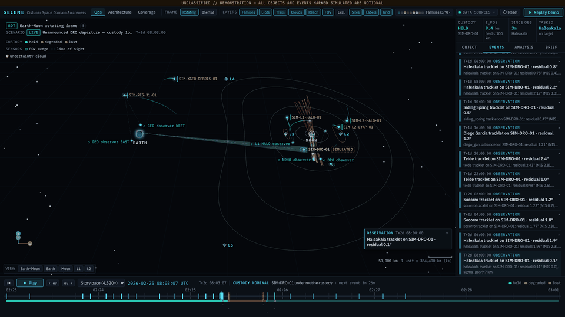
*The demo in 10 frames: quiet orbit, burn, detection, loss in lunar glare, re-tasking, recovery and the analyst brief.*

Click the Demo Scenario button in the top bar, or open `/ops?demo=1`. SELENE plays six simulated days, 23 February to 1 March 2026, in about two minutes.

A few inputs were picked by hand, and the scenario file records why. The burn is 30 m/s. It happens 30 minutes after the last routine ground observation, so exactly one ground look can catch it before the Moon's glare closes in. Its direction is the one, out of 256 sampled, that passes closest to L1 (a balance point between the Earth and the Moon). The engines computed everything else, including every number below.

**1. A quiet object.** SIM-DRO-01, a simulated spacecraft, circles the Moon in a distant retrograde orbit (DRO, a large and very stable loop around the Moon). Ground telescopes take a short series of measurements every two hours whenever one of them can see it. Before the burn SELENE knows its position to within 7 to 20 km, from 15 ground observations.

**2. An unannounced burn, caught in 90 minutes.** At 08:30 UTC on 25 February the notional actor fires its engine and changes the spacecraft's velocity by 30 m/s. Nobody sees it happen. At 10:00 UTC the telescope at Siding Spring, Australia, finds the object 97 arcseconds from where SELENE expected it. That is about a twentieth of the Moon's width in the sky, and far more than measurement noise can explain. SELENE's test score is 6,178, and anything above 18.3 raises an alarm, so SELENE declares a maneuver 1.5 hours after the burn.

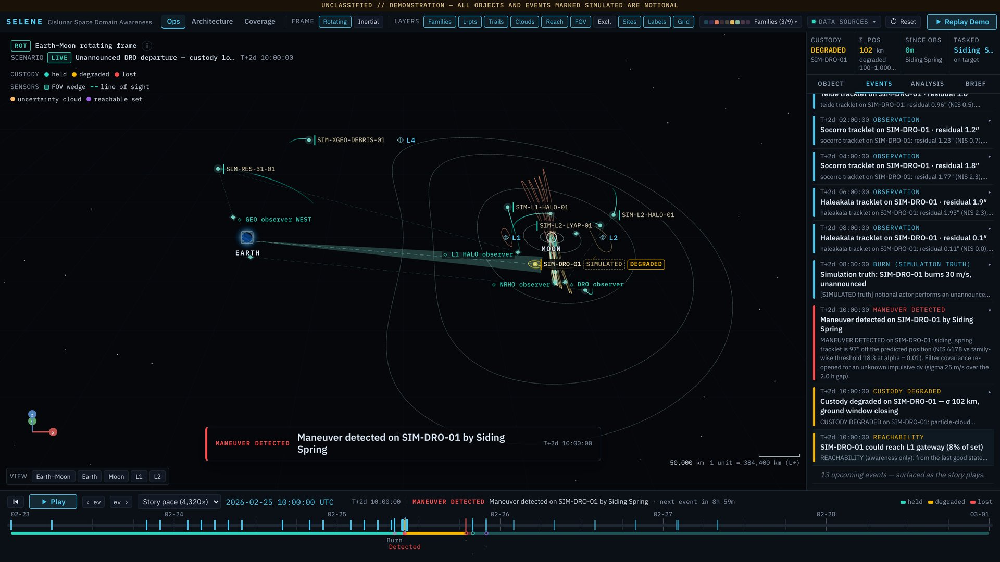
*One measurement is enough to see that something changed, but not enough to say what.*

**3. Where could it go?** As soon as the maneuver is flagged, SELENE runs reachability from its last good estimate (08:00 UTC). The question is where the object could get to on an assumed fuel budget. We assume it can change its velocity by up to 100 m/s more (its delta-v) over the next week. SELENE tries 288 burn directions at six sizes each, 1,728 burns in all. 24 of them (1.4%) carry it through the L1 gateway, and they come from 8% of the directions, which is the figure the on-screen alert shows. That is our name for the narrow passage near L1 that joins the space around the Moon to the space around Earth. It has nothing to do with NASA's Gateway station. The first of those arrives 33 hours after the last good estimate, and none needs less than 89 m/s.

Three samples pass the L2 gateway on the far side of the Moon, and they need at least 99 m/s. None of the sampled burns reach the corridor of the notional allied relay that flies the 9:2 NRHO (the orbit NASA's Gateway station will use). SELENE recommends watching the object closely and screening the relay for close approaches. It does not guess at intent.

**4. Blinded by the Moon.** The Moon is 61% lit, and the object sits about 10 degrees from it in the sky. From 11:00 UTC no ground telescope sees it again. For 79 of the next 86 hours the Moon's glare blocks every site that could see it. For the other 7 hours no site has it overhead at night.

With no new measurements, the uncertainty cloud (1,500 possible positions that all fit what we know) spreads out. At 19:00 UTC its spread passes 1,000 km (it peaks at 1,053 km) and SELENE declares custody lost.

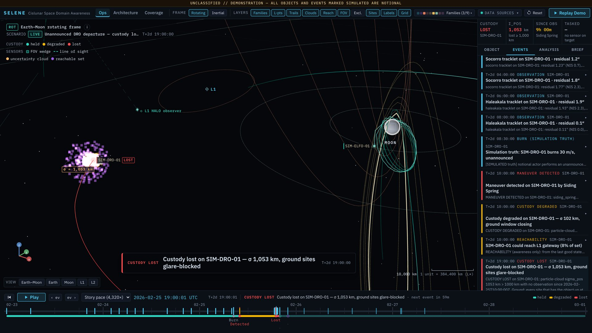
*Amber is where the spacecraft could be now. Violet is where it could get to on the assumed fuel budget.*

**5. Re-tasking and recovery.** At 20:00 UTC the SELENE tasker points five space-based sensors (two in GEO, one in a halo orbit looping around L1, one in a DRO and one in an NRHO) at the centre of the reachable set. The simulator then decides, from the spacecraft's true simulated position, whether each pointed sensor would actually have caught it (in the field of view and bright enough). The tracker only gets the measurements, never the true position. Custody comes back one hour after it was lost, 11.5 hours after the burn, and the position uncertainty drops to 0.4 km.

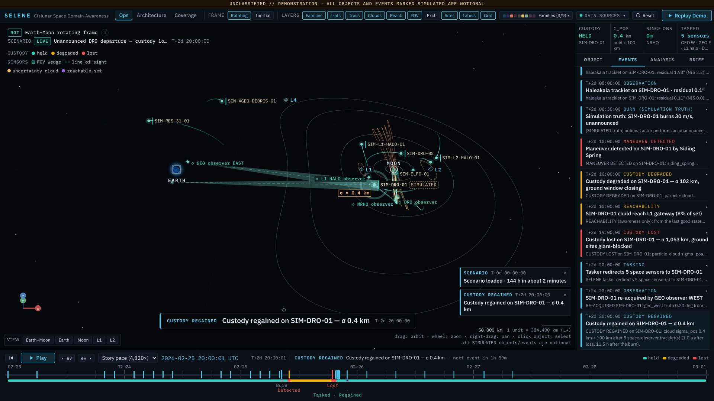
*Custody regained: all five tasked sensors pick the object up in the same 20:00 slot. Ground telescopes lose anything within 15° of a nearly full Moon because the atmosphere scatters moonlight. Space sensors have no atmosphere, so SELENE only rules out a 5° band around the Moon's edge for them, and the object, about 9° away, stays visible.*

**6. The burn measured, and a brief for the analyst.** By 22:00 UTC SELENE has reconstructed the burn from the new observations: 30.02 ± 0.03 m/s against a true 30.00 m/s (0.07% error), direction within 0.11 degrees, and burn time 45 seconds off. A plain-English analyst brief appears with a bottom line up front, a timeline and a glossary. It is filled in from a template, not written by a language model.

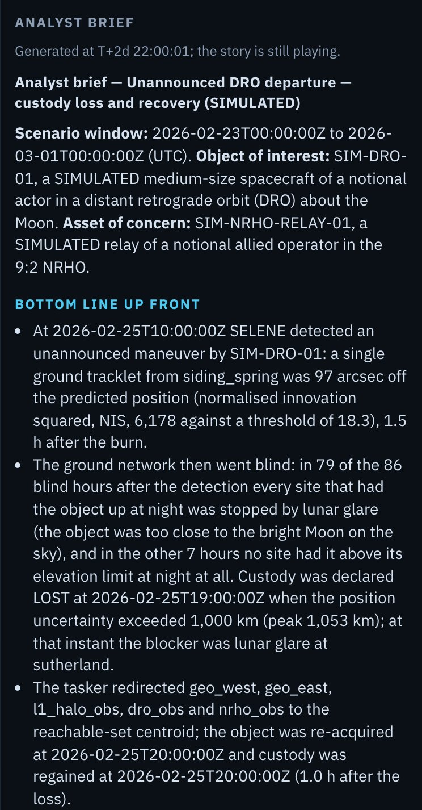

*The top of the auto-generated analyst brief. [Full-screen view](docs/images/demo-6-brief.jpg).*

On 27 February the spacecraft passes 260 km from the L1 point but stays on the Moon's side. SELENE logs that as a close approach, not a gateway crossing.

Over the six days SELENE knew where this object was for 93% of the hours.

## What's inside

### Ops console

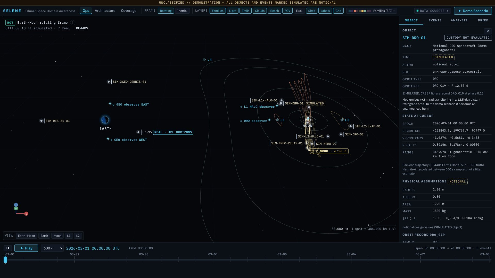
*The ops console at `/ops`. The header counts 18 objects: 11 simulated and 7 real.*

The main screen shows every tracked object around Earth and the Moon and whether SELENE still knows where it is. The 3D scene has the Earth, the Moon, the five Lagrange points (spots where Earth's and the Moon's gravity balance), families of repeating orbits, every catalog object with its trail, uncertainty clouds, sensor fields of view, and the zones around the Sun and Moon where telescopes cannot look. You can switch between a view that turns with the Earth-Moon line and one fixed against the stars. Around the scene sit a timeline with playback speed, an events feed and an object panel (position, orbit type, custody status, observation and maneuver history).

### Analysis panels

<table>
  <tr>
    <td width="50%" valign="top">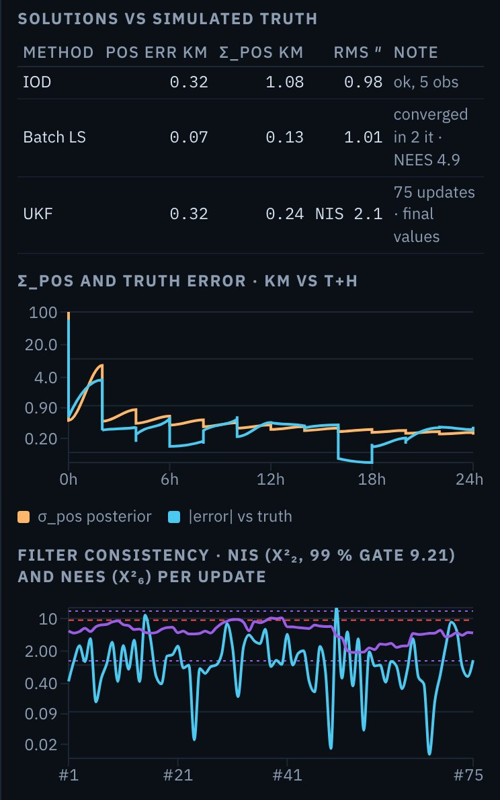<br><em>Orbit determination. From five measurements the first orbit is within 0.32 km of the truth; the batch fit gets it to 0.07 km.</em></td>
    <td width="50%" valign="top">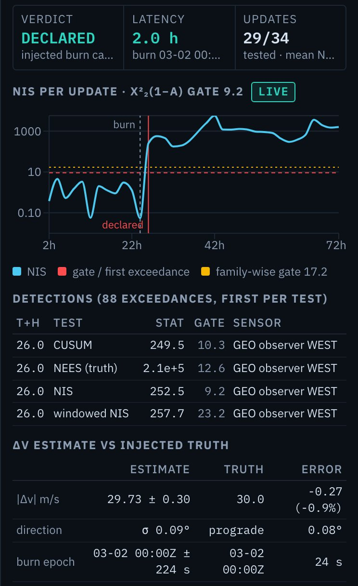<br><em>Maneuver detection. An injected 30 m/s burn is flagged 2 hours later and estimated at 29.73 ± 0.30 m/s.</em></td>
  </tr>
  <tr>
    <td width="50%" valign="top">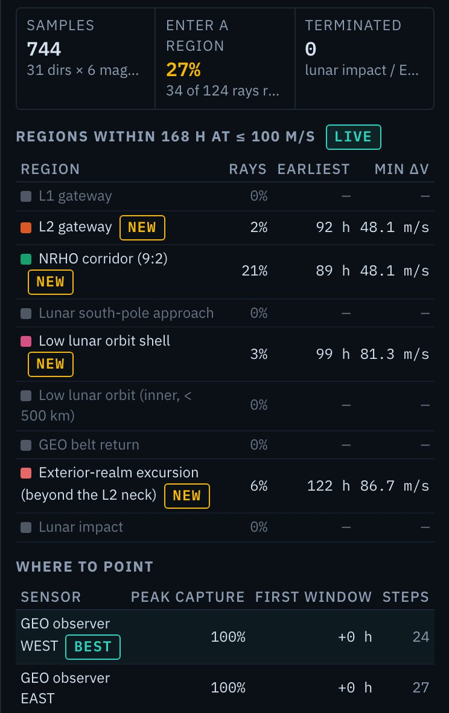<br><em>Reachability for SIM-DRO-01 on 1 March, after the demo window. From this starting point 21% of burn directions reach the NRHO corridor and none reach the L1 gateway.</em></td>
    <td width="50%" valign="top">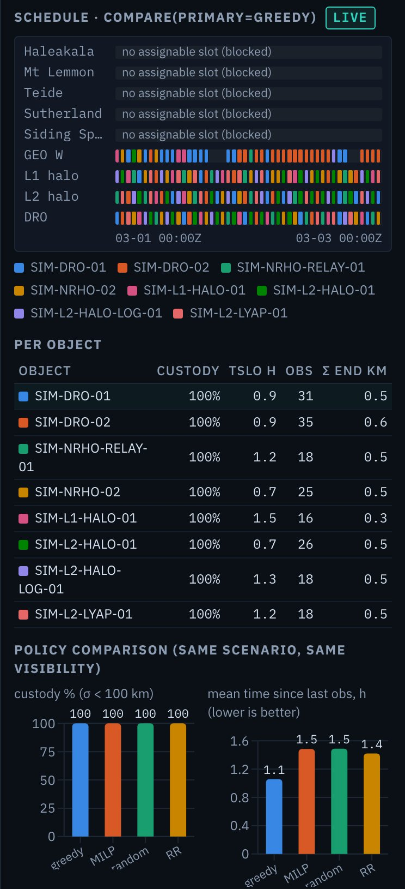<br><em>Sensor tasking near full Moon. The ground telescopes get no usable slot; the space sensors keep all 8 objects in custody.</em></td>
  </tr>
</table>

Full-screen versions: [orbit determination](docs/images/analysis-od.jpg), [maneuver detection](docs/images/analysis-maneuver.jpg), [reachability](docs/images/analysis-reach.jpg), [sensor tasking](docs/images/analysis-tasking.jpg).

The Analysis tab runs the engines live on the selected object, at the time under the timeline cursor. Each result takes one to a few seconds.

- Orbit determination works out an object's orbit from telescope angles alone. It shows how close it got to the simulated truth, how many looks were lost and why, and how fast the uncertainty grows once observations stop.
- Maneuver detection lets you inject a simulated burn (0 to 100 m/s, in any of ten directions) and watch whether and when the tests catch it. It then compares the estimated burn with the truth.
- Reachability draws every sampled end point in the 3D scene, coloured by the first important region it enters, and lists which sensors are best placed to look.
- Sensor tasking schedules the sensor network across a set of objects. It compares SELENE's scheduler with an optimizer, random choice and taking turns (round-robin).

### Coverage map

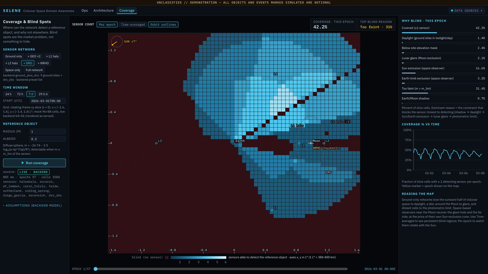
*The coverage page at `/coverage`, first hour of a 7-day run: 42% of the plane is covered, and the largest single reason for blindness is that the object is too faint (31%).*

The coverage page shows how much of the Earth-Moon plane a sensor network can see over a chosen window, and why each blind spot is blind: daylight, lunar glare, the Sun, Earth's shadow, or simply too faint. Take a 1-metre object over the week from 1 March 2026. Ground telescopes alone cover 35% of the plane on average. Adding the DRO observer raises that to 41%, and adding all five space observers (two in GEO, plus L1 halo, L2 halo and DRO) only gets to 44%. Most of the remaining area is so far away that a 1 m object is too faint to see.

### Architecture studio

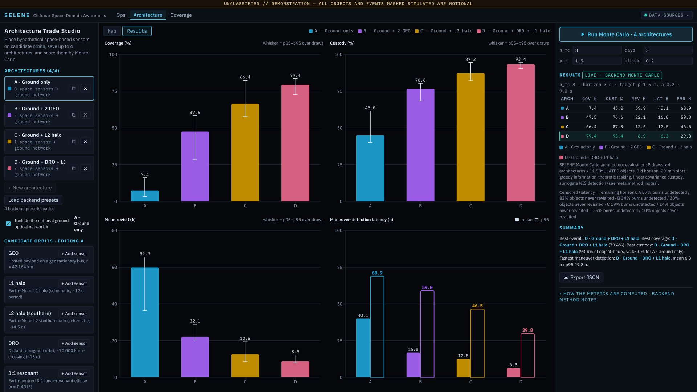
*The architecture studio at `/architecture`, after a run of the four preset architectures. The table below is the same run.*

The studio scores where to put new space telescopes. You add sensors to candidate orbits (GEO, L1 halo, L2 halo, DRO and a 3:1 resonant orbit that circles Earth three times per lunar month), set their aperture and field of view, save up to four architectures and click Run Monte Carlo. That runs the simulation many times, each time with a random start date and random unannounced burns by the simulated objects, and scores every architecture on the same set of runs. The four presets, run with 8 random trials over 3 days (the studio's defaults), give:

| Architecture | Coverage (objects visible) | Custody | Mean revisit | Burns caught | Mean time to detect |
|---|---|---|---|---|---|
| Ground telescopes only | 7.4% | 45.0% | 59.9 h | 13% | 40.1 h |
| Ground + 2 GEO sensors | 47.5% | 76.6% | 22.1 h | 66% | 16.8 h |
| Ground + L2 halo sensor | 66.4% | 87.3% | 12.6 h | 81% | 12.5 h |
| Ground + DRO + L1 halo sensors | 79.4% | 93.4% | 8.9 h | 91% | 6.3 h |

Coverage is the share of 20-minute time slots, summed over all objects, in which at least one sensor could see the object. Custody counts the slots in which the position uncertainty stays under 100 km. Each architecture faced the same 70 simulated burns. Time to detect counts a missed burn as the rest of the 3-day window, so an architecture that misses more burns scores worse here too. A ground-only network keeps custody less than half the time, and that gap is what SELENE's customers want to close.

With 8 trials this is a quick comparison. The studio draws the 5th to 95th percentile spread as whiskers on the coverage, custody and revisit charts, and shows the worst 5% next to the mean for detection time.

## Run it

The backend is Python (FastAPI, NumPy, SciPy). The web app is React with Three.js. You need Python 3.11 or newer, Node 20 or newer, `make` and `curl`. Nothing is installed globally: Python packages go into `.venv/` and JavaScript packages into `frontend/node_modules/`.

```bash
make setup     # Python venv, npm packages, and the JPL ephemeris files (about 33 MB, downloaded once)
make dev       # API on http://127.0.0.1:8000 and the web app on http://127.0.0.1:5173
```

Open <http://127.0.0.1:5173> and click Demo Scenario in the top bar. Ctrl-C stops both processes.

Other useful commands:

```bash
make demo         # builds the web app and serves everything from one process on http://127.0.0.1:8000
make test         # backend test suite: 518 passed, 1 skipped (a network-only test), about 30 s
make screenshots  # regenerates the images in this README (needs Chrome)
```

- After `make setup` everything runs offline from `data/`. `GET /api/health` reports `"offline": true`.
- Interactive API docs are at <http://127.0.0.1:8000/docs>. Every route is listed in [docs/API.md](docs/API.md).
- A `Dockerfile` and `docker-compose.yml` are included but untested, because Docker was not available on the build machine.

## How it works

Each engine is a Python module under `backend/selene/` with its own tests. The equations, validation tables and literature citations are in [docs/TECHNICAL.md](docs/TECHNICAL.md).

### Physics

SELENE uses two models of motion. The simple one (the circular restricted three-body problem, CR3BP) treats the Earth and Moon as two masses circling each other, and we use it to design orbits. The detailed one moves the Earth, Moon and Sun using JPL's DE440s planetary tables and adds the push of sunlight. It serves as "truth" and drives all tracking.

In the simple model one quantity, the Jacobi constant (a kind of orbital energy), should never change. Over ten orbits it drifts by less than one part in ten billion, so the numerical solver is not adding error of its own. Over two days the two models drift 475 km apart, about 0.1% of the Earth-Moon distance. We expect that, because the simple model ignores the Sun and the Moon's slightly oval orbit.

### Orbit catalog

325 repeating orbits in 9 families: Lyapunov orbits (flat loops) around L1 and L2, northern and southern halo orbits (three-dimensional loops) around L1 and L2, DROs, and 3:1 and 2:1 resonant orbits. The southern L2 halo family runs into the NRHOs. Each orbit is stored with its period and stability. Our 9:2 NRHO repeats every 6.5624 days and swings within 3,249 km of the Moon's centre (about 1,500 km above the surface), in line with the published 6.56 days. Orbits recomputed from JPL's own catalog of repeating orbits match it to better than one part in a million.

### Sensors

9 ground telescopes and 6 space-based observers (two in GEO, plus L1 halo, L2 halo, DRO and NRHO). For every look SELENE checks how bright the object is, whether it is too close to the Sun, Moon or Earth in the sky, whether it is in shadow, whether it is daytime at the site, and whether it is above the horizon. For ground telescopes the no-look zone around the Moon widens from 3° at new Moon to 15° at full Moon, because the atmosphere scatters moonlight. Space sensors use a fixed 5° band around the Moon's edge.

### Tracking

From angle measurements alone SELENE finds a first orbit, refines it with a batch fit over all the measurements, and then updates it one measurement at a time with an unscented Kalman filter (a standard tracking filter that copes with curved, nonlinear motion). When measurements stop, it moves a cloud of up to a few thousand possible states forward in time to show how custody decays. 2,000 states over 7 days take 0.07 s. It also checks that the filter's stated uncertainty matches its real error.

### Maneuver detection

Each new measurement is compared with the prediction and scaled by how uncertain the prediction was. Several statistical tests run side by side with a false-alarm rate you can set. At a 1% setting the measured false-alarm rate was 1.00% over 4,800 updates. A 5 m/s burn is caught on the first observation after it, and a 10 m/s burn is reconstructed to about 0.2% in size and 0.14° in direction.

### Reachability

SELENE samples burns in many directions and sizes up to an assumed budget and moves all of them forward together (2,000 trajectories over 72 hours in 0.2 s). It then reports which of 9 named regions each one reaches and how soon. The regions are the L1 and L2 gateways, the NRHO corridor, the lunar south-pole approach, low lunar orbit (with a separate band below 500 km), the GEO belt, departure beyond L2, and lunar impact. A gateway counts only if the path actually passes through from one side to the other, not if it merely comes close.

### Sensor tasking

A scheduler assigns sensors to objects in 20-minute slots. At each step it picks the look that shrinks the uncertainty the most. A mathematical optimizer is included for comparison. On a hard test case the simple scheduler kept custody 91.8% of the time and the optimizer 88.3%, and the simple scheduler also left less time between looks (1.27 h against 1.77 h on average). So SELENE uses the simple scheduler.

### Architecture scoring

For each candidate architecture SELENE runs repeated random trials. Every architecture sees the same objects, burns and noise in each trial, so the comparison stays fair even with few trials. It scores coverage, custody, revisit time and how long burns take to detect.

## What's real and what's simulated

Real: the positions of the Earth, Moon and Sun (JPL DE440s), the paths of 25 real objects from JPL Horizons, 21 spacecraft and 4 spent rocket stages (CAPSTONE, LRO, Danuri, Chandrayaan-2, THEMIS-B and C and TESS fall inside the demo dates and appear in the catalog), JPL's reference orbits, and the locations of the observatory sites.

Simulated: 11 notional spacecraft placed on published orbit types, every burn and event, every telescope measurement (with 1 arcsecond of random noise), and the sensor specifications. The telescope sites sit at real observatories, but their sizes and sensitivities are our assumptions, not the specs of any real instrument. SELENE refuses to run maneuver detection on a real spacecraft.

## Limitations

- Gravity treats the Earth, Moon and Sun as perfect spheres. The Moon's lumpy gravity and Earth's flattening are left out, which matters most for orbits close to the Moon.
- All observations are simulated. SELENE does not yet read real telescope data.
- Sensor specs, the lunar glare model and object brightness (modelled as smooth spheres) are stated assumptions. Weather, the atmosphere and sky brightness are not modelled.
- Measurements are not corrected for the time light takes to arrive. That is fine for simulated data, but real telescope data would need the correction.
- The architecture studio estimates detection time with a simplified model instead of running the full tracking filter for every trial, to keep each run to a few seconds.
- Every request runs while you wait. Long Monte Carlo jobs are capped rather than queued.
- There is no login. It is a local demo, not a deployed service.

The full list is in [docs/TECHNICAL.md](docs/TECHNICAL.md#assumptions-and-limitations).

## Project layout

```
selene/
├── backend/selene/     the engines and the API
│   ├── dynamics/       motion models and frame conversions
│   ├── orbits/         periodic-orbit catalog
│   ├── objects/        simulated spacecraft and cached JPL Horizons data
│   ├── sensors/        telescopes, visibility rules, coverage
│   ├── od/             orbit determination and uncertainty clouds
│   ├── maneuver/       maneuver detection and delta-v estimation
│   ├── reachability/   reachable sets and named regions
│   ├── tasking/        sensor scheduling
│   ├── architecture/   architecture Monte Carlo
│   ├── scenario/       the demo story and the analyst brief
│   └── api/            FastAPI routes
├── backend/tests/      45 test files
├── frontend/src/       React + Three.js web app (ops console, coverage, architecture studio)
├── data/               ephemeris cache, orbit catalog, Horizons cache, demo scenario
├── docs/               technical notes, API reference, screenshots
└── scripts/            screenshot capture for this README (make screenshots)
```

## Further reading

- [PITCH.md](PITCH.md): the problem, with public sources (the National Cislunar Science and Technology Strategy, the Space Force's Cislunar Coordination Office, AFRL's Oracle program), the customers, the competition, go-to-market, and the roadmap: real telescope data, a hosted sensor payload, accreditation.
- [docs/TECHNICAL.md](docs/TECHNICAL.md): equations, methods, validation results, assumptions and references.
- [docs/API.md](docs/API.md): every API route with examples.
- [PLAN.md](PLAN.md) and [PROGRESS.md](PROGRESS.md): the architecture, the governing equations, the milestones and their status.
- [DECISIONS.md](DECISIONS.md): engineering decisions, one line each.

## Glossary

| Term | Meaning |
|---|---|
| Cislunar space, xGEO | The space between geostationary orbit and the Moon, and around the Moon. |
| GEO | Geostationary orbit, about 36,000 km up, where a satellite appears to hang still over one spot on Earth. |
| Custody | Knowing where an object is well enough to find it again. SELENE counts an object as in custody while its position uncertainty is under 100 km, degraded between 100 and 1,000 km, and lost above 1,000 km. |
| Maneuver | An engine burn that changes an object's orbit. |
| Delta-v | How much a burn changes the velocity, in metres per second. |
| Lagrange points (L1 to L5) | Five spots where the pulls of Earth and Moon balance for an orbiting object. L1 sits between the Earth and Moon, L2 just beyond the Moon. Many cislunar orbits are anchored there. |
| L1 / L2 gateway | The narrow passage near L1 or L2 that an object must go through to leave the Moon's neighbourhood. Not related to NASA's Gateway station. |
| DRO | Distant retrograde orbit: a large, stable loop around the Moon. |
| NRHO | Near-rectilinear halo orbit: a stretched orbit over the lunar poles. The 9:2 NRHO is the one NASA's Gateway station will fly. |
| Halo orbit | A three-dimensional loop around L1 or L2. |
| Resonant orbit | An orbit whose period is a simple fraction of the Moon's month, such as 3:1. |
| Uncertainty cloud | A swarm of possible positions that all fit the measurements. Its spread shows how well we know where the object is. |
| Reachability | The set of places an object could reach with an assumed amount of fuel in a given time. |
| Sensor tasking | Deciding which sensor looks at which object, and when. |
| Orbit determination | Working out an object's orbit from measurements, here the angles a telescope sees. |
| Tracklet | A short series of measurements of one object from one sensor in one pass. |
| Arcsecond | 1/3600 of a degree. The Moon is about 1,800 arcseconds wide in the sky. |
| Monte Carlo | Running the same simulation many times with random inputs and averaging the results. |
| Ephemeris | A table of where a planet, moon or spacecraft is at each moment. |
| Notional actor | The made-up owner of the simulated spacecraft. Never a real country or company. |
